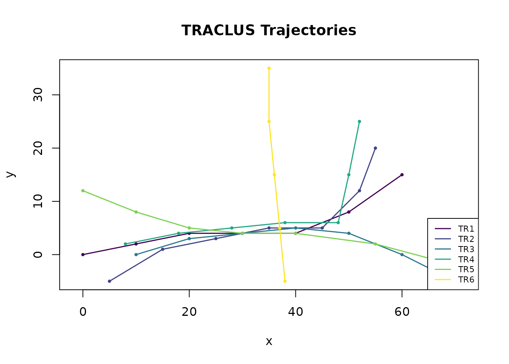
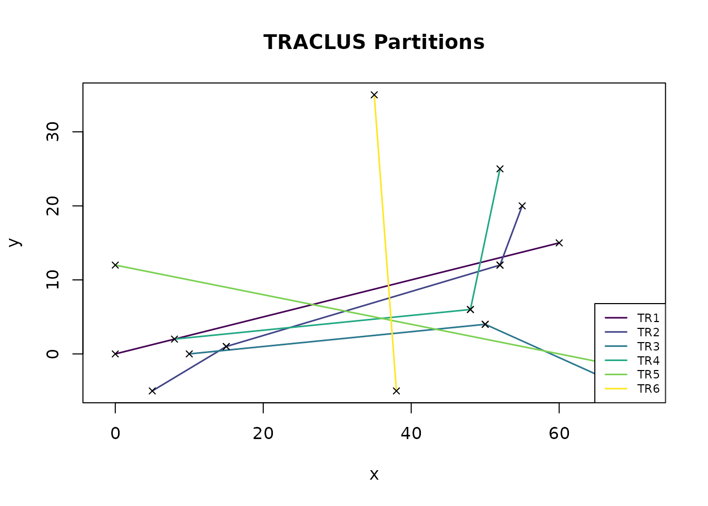
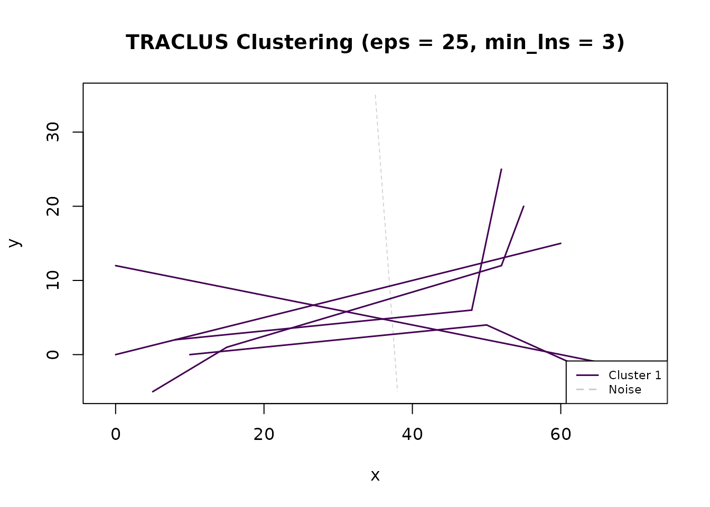
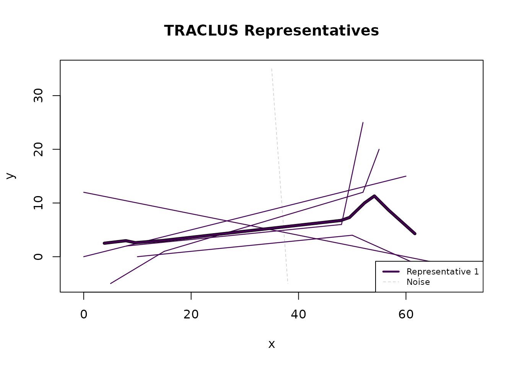
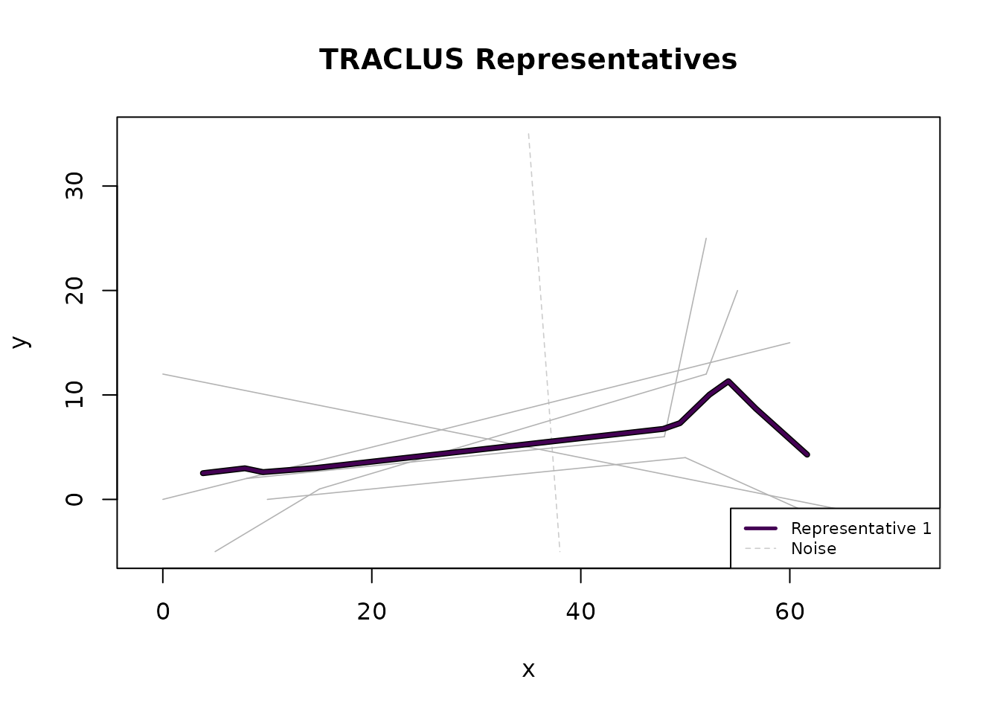

# Getting Started with TRACLUS

## Overview

The **TRACLUS** package implements the trajectory clustering algorithm
by Lee, Han & Whang (SIGMOD 2007). The algorithm works in three phases:

1.  **Partition** trajectories into line segments using Minimum
    Description Length (MDL).
2.  **Cluster** segments via DBSCAN density-based spatial clustering.
3.  **Represent** each cluster with a representative trajectory using a
    sweep-line algorithm.

This vignette walks through the complete workflow using the built-in toy
dataset.

## Setup

``` r
library(TRACLUS)
```

## Step 1: Load and prepare data

TRACLUS expects a data.frame with columns for trajectory ID,
x-coordinate, and y-coordinate. The built-in `traclus_toy` dataset
contains 6 euclidean trajectories:

``` r
head(traclus_toy)
#>   traj_id  x y
#> 1     TR1  0 0
#> 2     TR1 10 2
#> 3     TR1 20 4
#> 4     TR1 30 4
#> 5     TR1 40 4
#> 6     TR1 50 8

trj <- tc_trajectories(traclus_toy,
  traj_id = "traj_id",
  x = "x", y = "y", coord_type = "euclidean"
)
#> Loaded 6 trajectories (40 points).
trj
#> TRACLUS Trajectories
#>   Trajectories: 6
#>   Points:       40
#>   Coord type:   euclidean
#>   Method:       euclidean
#>   Status:       loaded (run tc_partition next)
```

Visualise the raw trajectories:

``` r
plot(trj)
```



## Step 2: Partition trajectories

MDL-based partitioning splits each trajectory at characteristic points
where the trajectory changes direction significantly:

``` r
parts <- tc_partition(trj)
#> Partitioned 6 trajectories into 10 line segments.
parts
#> TRACLUS Partitions
#>   Trajectories: 6
#>   Segments:     10
#>   Coord type:   euclidean
#>   Method:       euclidean
#>   Status:       partitioned (run tc_cluster next)
```

``` r
plot(parts)
```



The black X markers show the characteristic points selected by the MDL
criterion. Each trajectory is now represented as a sequence of line
segments.

## Step 3: Cluster segments

DBSCAN groups similar line segments into clusters. Two key parameters
control the result:

- **`eps`**: Maximum distance between segments to be considered
  neighbours.
- **`min_lns`**: Minimum number of neighbouring segments to form a
  cluster.

``` r
clust <- tc_cluster(parts, eps = 25, min_lns = 3)
#> Clustering: 1 cluster(s), 1 noise segment(s).
clust
#> TRACLUS Clusters
#>   Clusters:     1
#>   Noise segs:   1
#>   Total segs:   10
#>   eps:          25 (coordinate units)
#>   min_lns:      3
#>   Coord type:   euclidean
#>   Method:       euclidean
#>   Status:       clustered (run tc_represent next)
```

``` r
plot(clust)
```



Segments that do not belong to any cluster are classified as **noise**
(shown as dashed grey lines).

## Step 4: Generate representative trajectories

The sweep-line algorithm creates a representative trajectory for each
cluster by averaging the contributing segments:

``` r
repr <- tc_represent(clust)
#> Representatives: 1 trajectory(ies).
repr
#> TRACLUS Representatives
#>   Clusters:     1
#>   Noise segs:   1
#>   Waypoints:    10 total (10 per representative)
#>   gamma:        1
#>   min_lns:      3
#>   Coord type:   euclidean
#>   Method:       euclidean
#>   Status:       complete
```

``` r
plot(repr)
```


Use `show_clusters = TRUE` to see the cluster segments in colour
alongside the representatives:

``` r
plot(repr, show_clusters = TRUE)
```



## One-call pipeline

For convenience,
[`tc_traclus()`](https://martinhoblisch.github.io/TRACLUS/reference/tc_traclus.md)
runs the entire pipeline in a single call:

``` r
result <- tc_traclus(trj, eps = 25, min_lns = 3)
#> Partitioned 6 trajectories into 10 line segments.
#> Clustering: 1 cluster(s), 1 noise segment(s).
#> Representatives: 1 trajectory(ies).
result
#> TRACLUS Result (all-in-one)
#>   Clusters:     1
#>   Noise segs:   1
#>   Waypoints:    10 total (10 per representative)
#>   eps:          25 (coordinate units)
#>   min_lns:      3
#>   gamma:        1
#>   Coord type:   euclidean
#>   Method:       euclidean
#>   Status:       complete
```

``` r
plot(result)
```



## Inspecting results

Every object has [`print()`](https://rdrr.io/r/base/print.html),
[`summary()`](https://rdrr.io/r/base/summary.html), and
[`plot()`](https://rdrr.io/r/graphics/plot.default.html) methods:

``` r
summary(result)
#> TRACLUS Result - Summary
#>   Input trajs:        6
#>   Partitioned into:   10 segments
#>   Clusters:           1
#>   Total segments:     10
#>   Noise segments:     1 (10.0%)
#>   WPs per repr:       min = 10, median = 10, max = 10
#>   eps:                25 (coordinate units)
#>   min_lns:            3
#>   gamma:              1
#>   Coord type:         euclidean
#>   Method:             euclidean
```

## Trial-and-error: re-clustering with different parameters

A key design feature of TRACLUS is that each phase returns a **new
object** without modifying its input. This means you can re-use the same
`tc_partitions` object to try different `eps` and `min_lns` values — no
need to re-partition every time:

``` r
# Partition once
parts <- tc_partition(trj)
#> Partitioned 6 trajectories into 10 line segments.

# Try different clustering parameters on the same partitions
clust_tight <- tc_cluster(parts, eps = 15, min_lns = 3)
#> Clustering: 1 cluster(s), 3 noise segment(s).
clust_medium <- tc_cluster(parts, eps = 25, min_lns = 3)
#> Clustering: 1 cluster(s), 1 noise segment(s).
clust_wide <- tc_cluster(parts, eps = 40, min_lns = 2)
#> Clustering: 1 cluster(s), 1 noise segment(s).

cat(sprintf(
  "eps=15: %d cluster(s), %.0f%% noise\n",
  clust_tight$n_clusters,
  100 * clust_tight$n_noise / nrow(clust_tight$segments)
))
#> eps=15: 1 cluster(s), 30% noise
cat(sprintf(
  "eps=25: %d cluster(s), %.0f%% noise\n",
  clust_medium$n_clusters,
  100 * clust_medium$n_noise / nrow(clust_medium$segments)
))
#> eps=25: 1 cluster(s), 10% noise
cat(sprintf(
  "eps=40: %d cluster(s), %.0f%% noise\n",
  clust_wide$n_clusters,
  100 * clust_wide$n_noise / nrow(clust_wide$segments)
))
#> eps=40: 1 cluster(s), 10% noise
```

This makes parameter exploration fast and convenient. See
[`vignette("TRACLUS-parameter-guide")`](https://martinhoblisch.github.io/TRACLUS/articles/TRACLUS-parameter-guide.md)
for systematic guidance on choosing good values.

## Which `coord_type` do I need?

When creating trajectories with
[`tc_trajectories()`](https://martinhoblisch.github.io/TRACLUS/reference/tc_trajectories.md),
the `coord_type` argument tells TRACLUS how to measure distances: \|
Your data \| `coord_type` \| `eps` units \| \|———–\|————–\|————-\| \|
Synthetic / simulation (arbitrary x, y) \| `"euclidean"` \| Same as your
coordinates \| \| GPS tracks, ship routes, flight paths (lon, lat in
degrees) \| `"geographic"` \| **Metres** \| \| OpenStreetMap or any
WGS-84 source \| `"geographic"` \| **Metres** \|

**Coordinate convention for geographic data:** `x` = longitude (−180 to
180), `y` = latitude (−90 to 90). This follows the mathematical
convention (x = horizontal axis). If your data has latitude first, swap
the column assignments:

``` r
# Latitude-first data? Just swap x and y:
trj <- tc_trajectories(df, traj_id = "id",
                       x = "longitude", y = "latitude",
                       coord_type = "geographic")
```

TRACLUS will warn you if it detects that x and y might be swapped (e.g.,
all x values in \[−90, 90\] while y values are outside that range).

For geographic data, you can also control *how* distances are computed
with the optional `method` argument:

- `method = "projected"` *(default)*: 5–10× faster than haversine with
  \< 2 % error. Recommended for most regional datasets.
- `method = "haversine"`: Exact great-circle distances. Use for global
  datasets or when maximum accuracy is needed.

See
[`vignette("TRACLUS-spherical-geometry")`](https://martinhoblisch.github.io/TRACLUS/articles/TRACLUS-spherical-geometry.md)
for a full comparison of the three available methods.

## Using sf objects

If your data is already an `sf` object, you can pass it directly to
[`tc_trajectories()`](https://martinhoblisch.github.io/TRACLUS/reference/tc_trajectories.md)
— no need to specify `x`, `y`, or `coord_type`:

``` r
if (requireNamespace("sf", quietly = TRUE)) {
  geo <- data.frame(
    id  = rep(c("A", "B", "C"), each = 5),
    lon = c(-80, -78, -76, -74, -72, -82, -79, -76, -73, -70, -60, -58, -56, -54, -52),
    lat = c(25, 26, 27, 28, 29, 24, 25, 26, 27, 28, 30, 31, 32, 33, 34)
  )
  geo_sf <- sf::st_as_sf(geo, coords = c("lon", "lat"), crs = 4326)
  trj_sf <- tc_trajectories(geo_sf, traj_id = "id")
  trj_sf
}
#> Loaded 3 trajectories (15 points).
#> TRACLUS Trajectories
#>   Trajectories: 3
#>   Points:       15
#>   Coord type:   geographic
#>   Method:       haversine
#>   Status:       loaded (run tc_partition next)
```

Three requirements apply to sf input:

1.  **POINT geometry required.** Other geometry types must be converted
    first:

    ``` r
    point_sf <- sf::st_cast(your_sf, "POINT")
    ```

2.  **CRS must be set.** The CRS determines whether distances are
    geographic or euclidean. If missing, assign it before calling
    [`tc_trajectories()`](https://martinhoblisch.github.io/TRACLUS/reference/tc_trajectories.md):

    ``` r
    data_sf <- sf::st_set_crs(data_sf, 4326)  # WGS-84
    ```

3.  **Z/M coordinates are dropped.** Only X and Y are used by TRACLUS.

## Next steps

- See
  [`vignette("TRACLUS-real-world")`](https://martinhoblisch.github.io/TRACLUS/articles/TRACLUS-real-world.md)
  for an example with real hurricane track data.
- See
  [`vignette("TRACLUS-parameter-guide")`](https://martinhoblisch.github.io/TRACLUS/articles/TRACLUS-parameter-guide.md)
  for guidance on choosing `eps` and `min_lns`.
- See
  [`vignette("TRACLUS-spherical-geometry")`](https://martinhoblisch.github.io/TRACLUS/articles/TRACLUS-spherical-geometry.md)
  for details on geographic (spherical) distance calculations.
