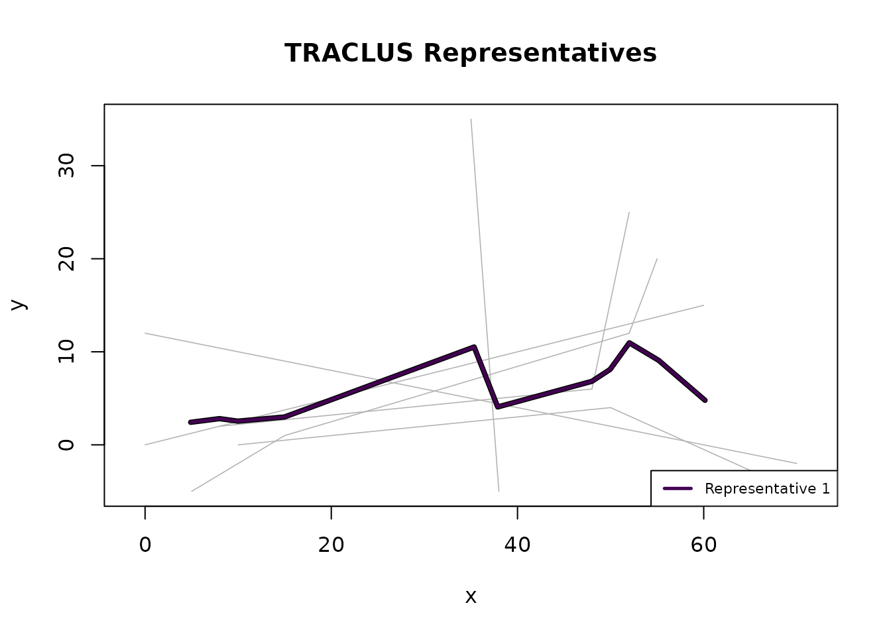

# Parameter Guide

## Overview

The TRACLUS algorithm has two critical parameters:

- **`eps`** — the neighbourhood radius for DBSCAN clustering
- **`min_lns`** — the minimum number of neighbouring segments to form a
  cluster

Choosing appropriate values is essential for meaningful results. This
vignette explains the parameters and demonstrates the entropy-based
estimation heuristic.

## Understanding eps

`eps` defines the maximum weighted distance between two line segments
for them to be considered neighbours. The weighted distance is:

$$d\left( L_{i},L_{j} \right) = w_{\bot} \cdot d_{\bot} + w_{\parallel} \cdot d_{\parallel} + w_{\angle} \cdot d_{\angle}$$

where the three components capture perpendicular offset, parallel
displacement, and angular difference respectively.

- **Euclidean data:** `eps` is in the same coordinate units as the data.
- **Geographic data:** `eps` is in **metres** (`method = "haversine"` or
  `"projected"`).

### Effect of eps

- **Too small:** Every segment is noise; no clusters are found.
- **Too large:** All segments merge into a single cluster, losing
  structure.
- **Just right:** Meaningful clusters emerge that correspond to common
  trajectory patterns.

``` r
library(TRACLUS)

trj <- tc_trajectories(traclus_toy,
  traj_id = "traj_id",
  x = "x", y = "y", coord_type = "euclidean"
)
#> Loaded 6 trajectories (40 points).
parts <- tc_partition(trj)
#> Partitioned 6 trajectories into 10 line segments.

# Too small: 0 clusters
c1 <- suppressWarnings(tc_cluster(parts, eps = 1, min_lns = 3))
#> Clustering: 0 cluster(s), 10 noise segment(s).
cat("eps = 1:  ", c1$n_clusters, "clusters\n")
#> eps = 1:   0 clusters

# Reasonable: meaningful clusters
c2 <- suppressWarnings(tc_cluster(parts, eps = 25, min_lns = 3))
#> Clustering: 1 cluster(s), 1 noise segment(s).
cat("eps = 25: ", c2$n_clusters, "clusters\n")
#> eps = 25:  1 clusters

# Too large: everything in one cluster
c3 <- suppressWarnings(tc_cluster(parts, eps = 500, min_lns = 3))
#> Clustering: 1 cluster(s), 0 noise segment(s).
cat("eps = 500:", c3$n_clusters, "clusters\n")
#> eps = 500: 1 clusters
```

## Understanding min_lns

`min_lns` sets the minimum number of neighbouring segments a core
segment must have for DBSCAN expansion. Additionally, after clustering,
any cluster whose member segments come from fewer than `min_lns`
distinct trajectories is removed (the **cardinality check** from the
paper).

- **Too small (e.g., 1):** Almost every segment forms its own cluster.
- **Too large:** Only very dense regions form clusters; most segments
  become noise.

### Why min_lns \< 3 can produce misleading results

`min_lns` also controls the sweep-line density threshold in
representative generation (Phase 3). The sweep-line generates a waypoint
only when enough segments cross the current position. However, when
consecutive segments from the **same trajectory** share an endpoint (a
characteristic point), both segments are momentarily counted at that
position due to the entry-before-exit event processing. With
`min_lns = 2`, this momentary peak of 2 is enough to create a waypoint —
even though both segments come from a single trajectory.

Three or more consecutive segments from one trajectory create 2+
waypoints at their shared endpoints, producing a representative that
simply traces that trajectory’s path instead of capturing a common
sub-trajectory from multiple sources.

**Our fix:** The sweep-line additionally checks that at least 2 distinct
trajectories are represented among the active segments before generating
a waypoint. This eliminates the degenerate case without affecting
results for `min_lns >= 3`.

The original TRACLUS paper (Lee, Han & Whang 2007) does not include this
check because all experiments use MinLns = 6–9 (Section 4.4), where the
edge case cannot occur. Our extension is consistent with the paper’s
Phase 2 cardinality check, which also requires trajectory diversity.

**Recommendation:** Use `min_lns >= 3`, or better yet, use the
data-driven estimate from
[`tc_estimate_params()`](https://martinhoblisch.github.io/TRACLUS/reference/tc_estimate_params.md)
which typically suggests values of 5 or higher.

## Automatic parameter estimation

[`tc_estimate_params()`](https://martinhoblisch.github.io/TRACLUS/reference/tc_estimate_params.md)
provides a data-driven starting point using the entropy heuristic from
Section 4.4 of the TRACLUS paper:

1.  Compute pairwise distances for a sample of segments.
2.  For each candidate `eps`, count how many neighbours each segment
    has.
3.  Compute the Shannon entropy of the neighbourhood-size distribution.
4.  Select the `eps` that **minimises** entropy (sharpest clustering
    structure).
5.  Set `min_lns = ceiling(mean neighbourhood size at optimal eps) + 1`.

``` r
set.seed(42)
est <- tc_estimate_params(parts)
#> Estimated parameters: eps = 64.31, min_lns = 3 (grid: 8.234 to 78.69, 50 points).
est
#> TRACLUS Parameter Estimate
#>   Optimal eps:  64.31 (coordinate units)
#>   Est. min_lns: 3
#>   Grid range:   8.234 to 78.69 (50 points)
```

``` r
plot(est)
```


The plot shows the entropy across all tested eps values. Inspect it
visually — a pronounced drop or elbow in the curve is often a more
reliable guide than the minimum. Use the estimates as a starting point,
then refine based on domain knowledge.

## Using estimated parameters

``` r
result <- suppressWarnings(
  tc_traclus(trj, eps = est$eps, min_lns = est$min_lns)
)
#> Partitioned 6 trajectories into 10 line segments.
#> Clustering: 1 cluster(s), 0 noise segment(s).
#> Representatives: 1 trajectory(ies).
result
#> TRACLUS Result (all-in-one)
#>   Clusters:     1
#>   Noise segs:   0
#>   Waypoints:    11 total (11 per representative)
#>   eps:          64.31 (coordinate units)
#>   min_lns:      3
#>   gamma:        1
#>   Coord type:   euclidean
#>   Method:       euclidean
#>   Status:       complete
plot(result)
```



## Distance weights

The three distance components can be weighted differently using
`w_perp`, `w_par`, and `w_angle`:

``` r
# Emphasise angular similarity
c_angle <- suppressWarnings(
  tc_cluster(parts,
    eps = 25, min_lns = 3,
    w_perp = 0.5, w_par = 0.5, w_angle = 2
  )
)
#> Clustering: 1 cluster(s), 1 noise segment(s).
cat("Angle-heavy: ", c_angle$n_clusters, "clusters\n")
#> Angle-heavy:  1 clusters

# Emphasise perpendicular distance
c_perp <- suppressWarnings(
  tc_cluster(parts,
    eps = 25, min_lns = 3,
    w_perp = 2, w_par = 0.5, w_angle = 0.5
  )
)
#> Clustering: 1 cluster(s), 1 noise segment(s).
cat("Perp-heavy:  ", c_perp$n_clusters, "clusters\n")
#> Perp-heavy:   1 clusters
```

## The gamma parameter

The `gamma` parameter in
[`tc_represent()`](https://martinhoblisch.github.io/TRACLUS/reference/tc_represent.md)
(and
[`tc_traclus()`](https://martinhoblisch.github.io/TRACLUS/reference/tc_traclus.md))
controls the minimum spacing between waypoints in the representative
trajectory. The default value of 1 works well for most cases:

- **Smaller gamma:** More waypoints, higher fidelity to the underlying
  segments.
- **Larger gamma:** Fewer waypoints, smoother representative.

``` r
repr1 <- tc_represent(c2, gamma = 1)
#> Representatives: 1 trajectory(ies).
repr5 <- tc_represent(c2, gamma = 5)
#> Representatives: 1 trajectory(ies).

cat("gamma = 1:", nrow(repr1$representatives), "total waypoints\n")
#> gamma = 1: 10 total waypoints
cat("gamma = 5:", nrow(repr5$representatives), "total waypoints\n")
#> gamma = 5: 6 total waypoints
```

## Guidelines

| Parameter | Euclidean                              | Geographic                                                                                                  |
|-----------|----------------------------------------|-------------------------------------------------------------------------------------------------------------|
| `eps`     | Same units as coordinates              | Metres (e.g., 100000 = 100 km)                                                                              |
| `min_lns` | 3–5 for small datasets                 | 3+ (use [`tc_estimate_params()`](https://martinhoblisch.github.io/TRACLUS/reference/tc_estimate_params.md)) |
| `gamma`   | 1 (default) usually fine               | 1 (default) usually fine                                                                                    |
| Weights   | Equal (default) unless domain-specific | Equal (default)                                                                                             |
| `method`  | N/A                                    | `"projected"` (default, fast) or `"haversine"` (exact)                                                      |

**Practical workflow:**

1.  Run
    [`tc_estimate_params()`](https://martinhoblisch.github.io/TRACLUS/reference/tc_estimate_params.md)
    for a data-driven starting point.
2.  Try the suggested values with
    [`tc_traclus()`](https://martinhoblisch.github.io/TRACLUS/reference/tc_traclus.md).
3.  Inspect [`plot()`](https://rdrr.io/r/graphics/plot.default.html) and
    [`summary()`](https://rdrr.io/r/base/summary.html) output.
4.  Adjust `eps` up (fewer clusters) or down (more clusters) as needed.
5.  Fine-tune `min_lns` if noise/cluster balance is off.
