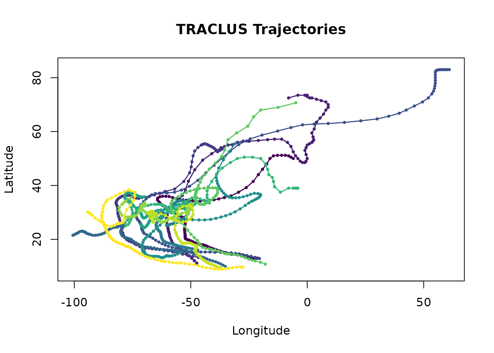
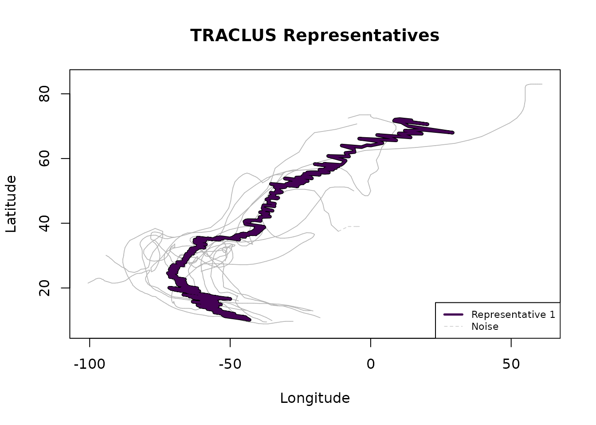
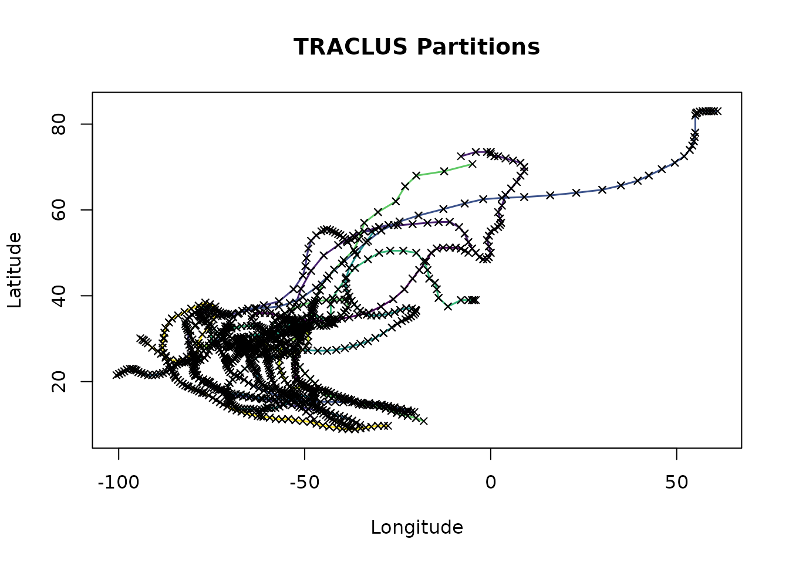

# Real-World Example: Hurricane Tracks

## Overview

This vignette demonstrates TRACLUS on geographic trajectory data using
Atlantic hurricane tracks in HURDAT2 format. The bundled dataset
contains **826 named Atlantic storms from 1950 to 2004** with over
22,000 track points. No internet connection is required.

## Reading HURDAT2 data

The
[`tc_read_hurdat2()`](https://martinhoblisch.github.io/TRACLUS/reference/tc_read_hurdat2.md)
function parses NOAA’s HURDAT2 Best-Track format, converting West
longitudes to negative values and filtering storms with fewer than a
minimum number of track points:

``` r
library(TRACLUS)

filepath <- system.file("extdata", "hurdat2_1950_2004.txt",
  package = "TRACLUS"
)
storms <- tc_read_hurdat2(filepath, min_points = 3)
#> Filtered 1 storm(s) with < 3 points.
cat("Storms:", length(unique(storms$storm_id)), "\n")
#> Storms: 825
cat("Points:", nrow(storms), "\n")
#> Points: 22453
head(storms)
#>   storm_id  lat   lon
#> 1 AL011950 17.1 -55.5
#> 2 AL011950 17.7 -56.3
#> 3 AL011950 18.2 -57.4
#> 4 AL011950 19.0 -58.6
#> 5 AL011950 20.0 -60.0
#> 6 AL011950 20.7 -61.1
```

## Working with a subset

The full dataset contains hundreds of storms. For demonstration and
interactive exploration, it is practical to work with a subset. Use
`min_points` to select only storms with long tracks (which tend to be
the most significant hurricanes):

``` r
# Select only storms with >= 80 track points (long-lived storms)
long_storms <- tc_read_hurdat2(filepath, min_points = 80)
#> Filtered 813 storm(s) with < 80 points.
cat("Long-lived storms:", length(unique(long_storms$storm_id)), "\n")
#> Long-lived storms: 13
cat("Points:", nrow(long_storms), "\n")
#> Points: 1190
```

## Creating trajectory objects

For geographic data, set `coord_type = "geographic"`. The x-column must
contain longitude and the y-column must contain latitude:

``` r
trj <- tc_trajectories(long_storms,
  traj_id = "storm_id",
  x = "lon", y = "lat",
  coord_type = "geographic"
)
#> Warning: Removed 3 consecutive duplicate point(s).
#> Loaded 13 trajectories (1187 points).
trj
#> TRACLUS Trajectories
#>   Trajectories: 13
#>   Points:       1187
#>   Coord type:   geographic
#>   Method:       haversine
#>   Status:       loaded (run tc_partition next)
```

``` r
plot(trj)
```



## Full pipeline

With geographic data, distances are in **metres**. TRACLUS offers three
methods for geographic data (set via the `method` argument in
[`tc_trajectories()`](https://martinhoblisch.github.io/TRACLUS/reference/tc_trajectories.md)):

- `"projected"` *(default)*: Equirectangular projection to metres, then
  euclidean distances. 5–10× faster than haversine with \< 2 % error for
  regional datasets such as Atlantic hurricane tracks. Recommended for
  most use cases.
- `"haversine"`: Exact great-circle distances. Use for global datasets
  or when maximum accuracy is required.
- `"euclidean"`: Raw degree values treated as Cartesian. Only for paper
  replication.

A reasonable `eps` for Atlantic hurricanes is in the range of hundreds
of kilometres:

``` r
# method = "projected" is the default — fast and accurate for regional data
result <- tc_traclus(trj, eps = 500000, min_lns = 3)
#> Partitioned 13 trajectories into 1151 line segments.
#> Clustering: 1 cluster(s), 5 noise segment(s).
#> Representatives: 1 trajectory(ies).
result
#> TRACLUS Result (all-in-one)
#>   Clusters:     1
#>   Noise segs:   5
#>   Waypoints:    1113 total (1113 per representative)
#>   eps:          5e+05 (meters)
#>   min_lns:      3
#>   gamma:        1
#>   Coord type:   geographic
#>   Method:       haversine
#>   Status:       complete
```

``` r
plot(result)
```



``` r
summary(result)
#> TRACLUS Result - Summary
#>   Input trajs:        13
#>   Partitioned into:   1151 segments
#>   Clusters:           1
#>   Total segments:     1151
#>   Noise segments:     5 (0.4%)
#>   WPs per repr:       min = 1113, median = 1113, max = 1113
#>   eps:                5e+05 (meters)
#>   min_lns:            3
#>   gamma:              1
#>   Coord type:         geographic
#>   Method:             haversine
```

## Interactive Leaflet map

If the `leaflet` package is installed,
[`tc_leaflet()`](https://martinhoblisch.github.io/TRACLUS/reference/tc_leaflet.md)
creates an interactive map with multiple tile layers and hover labels:

``` r
tc_leaflet(result)
```

The map supports three base layers (CartoDB Positron, OpenStreetMap,
Esri World Imagery) and can be further customised via standard `leaflet`
piping.

## Step-by-step with inspection

For more control, run each step individually:

``` r
parts <- tc_partition(trj)
#> Partitioned 13 trajectories into 1151 line segments.
parts
#> TRACLUS Partitions
#>   Trajectories: 13
#>   Segments:     1151
#>   Coord type:   geographic
#>   Method:       haversine
#>   Status:       partitioned (run tc_cluster next)

clust <- tc_cluster(parts, eps = 500000, min_lns = 3)
#> Clustering: 1 cluster(s), 5 noise segment(s).
clust
#> TRACLUS Clusters
#>   Clusters:     1
#>   Noise segs:   5
#>   Total segs:   1151
#>   eps:          5e+05 (meters)
#>   min_lns:      3
#>   Coord type:   geographic
#>   Method:       haversine
#>   Status:       clustered (run tc_represent next)

repr <- tc_represent(clust)
#> Representatives: 1 trajectory(ies).
repr
#> TRACLUS Representatives
#>   Clusters:     1
#>   Noise segs:   5
#>   Waypoints:    1113 total (1113 per representative)
#>   gamma:        1
#>   min_lns:      3
#>   Coord type:   geographic
#>   Method:       haversine
#>   Status:       complete
```

Each intermediate object can be plotted or mapped independently:

``` r
plot(parts)
```



``` r
tc_leaflet(parts)
```

## Scaling to the full dataset

For production analyses with all 800+ storms, the clustering step
involves O(n²) pairwise distance comparisons and may take several
minutes. Consider:

- Using `method = "projected"` (the default) to reduce computation time
  by 5–10× compared to `"haversine"` with negligible accuracy loss.
- Using
  [`tc_estimate_params()`](https://martinhoblisch.github.io/TRACLUS/reference/tc_estimate_params.md)
  on the full partitions to find good starting parameters.
- Pre-filtering storms by year range or geographic region.
- Starting with a higher `min_points` threshold to reduce the number of
  segments.
